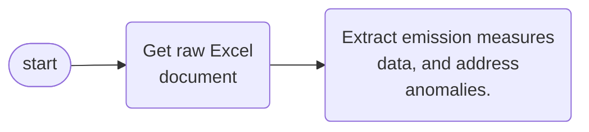

 

### Organisations & Documents

Public Health Scotland's climate & sustainability analysis focuses on 22 health organisations.  Each organisation falls under one of [three organisation types](https://www.scot.nhs.uk/organisations/):

* 14 Regional
* 7 Special
* 1 Public Health

Each organisation has submitted one or more annual climate measures reports to [Sustainable Network Scotland](https://sustainablescotlandnetwork.org/reports).  Each of these reports has a distinct document code, hence systematic/programmatic retrieval is possible.  Altogether, a plausible relationship between organisation types, organisations, and documents is

 

 
 

### Documents & Emission Measures

The emissions measures are recorded within a single sheet, but the name of this sheet is not the same across the years.  Bearing this in mind, programmatically

* [Retrieving](/warehouse/raw/) a set Excel documents from the Sustainable Scotland Network, and
* Extracting the emission measures data, and addressing anomalies.

 

suggests data fields as recorded in the [warehouse/excerpt/](/warehouse/excerpt/) files.  Additionally, the corresponding standard structure for analytics, including forecasting, will be akin to [warehouse/structures/simple.csv](/warehouse/structures/simple.csv).  

The latter, i.e., [warehouse/structures/simple.csv](/warehouse/structures/simple.csv), is a concatenation of data across health organisations and years; this exercise stopped at [five documents](https://github.com/prml-0003/fetch/blob/908d0ae8e2f08b409b482917ceb1b5608323ee8c/src/data/interface.py#L88).  It excludes the text format of drop-down-menu values; these values should be represented by numeric identifiers, which minimises errors.  Note that the

 

> numeric identifier field for emission_factor_unit **has not been set yet**.

 

This should involve extending the [units of measure table](/data/units.csv), such that it includes all the distinct *unit of measures* of emission factors.  Visit the [data](/data/) to explore a few dimension tables suggestions.

 
 

### References

* [Health Boards Names & Codes](https://geoportal.statistics.gov.uk/documents/844159d820da487686d124a25e2eb84d/about)
* Population
  * [Time Series Estimates](https://www.nrscotland.gov.uk/statistics-and-data/statistics/statistics-by-theme/population/population-estimates/mid-year-population-estimates/population-estimates-time-series-data)
  * [Mid Year Estimates](https://www.nrscotland.gov.uk/statistics-and-data/statistics/statistics-by-theme/population/population-estimates/mid-year-population-estimates)

 
 

 
 

 
 

 
 
