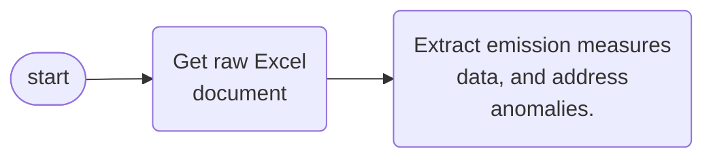

 

### Organisations & Documents

 

Public Health Scotland's climate & sustainability analysis focuses on 22 health organisations.  Each organisation falls under one of [three organisation types](https://www.scot.nhs.uk/organisations/):

* 14 Regional
* 7 Special
* 1 Public Health

Each organisation has submitted one or more annual climate measures reports to [Sustainable Network Scotland](https://sustainablescotlandnetwork.org/reports).  Each of these reports has a distinct document code, hence systematic/programmatic retrieval is possible.  Altogether, a plausible relationship between organisation types, organisations, and documents is

 

 

### Documents & Emission Measures

The emissions measures are recorded within a single sheet, but the name of this sheet is not the same across the years.  Bearing this in mind, programmatically

* Retrieving a set Excel documents from the Sustainable Scotland Network, and
* Extracting the emission measures data, and addressing anomalies

 

suggests

 
 

 
 

 
 

 
 