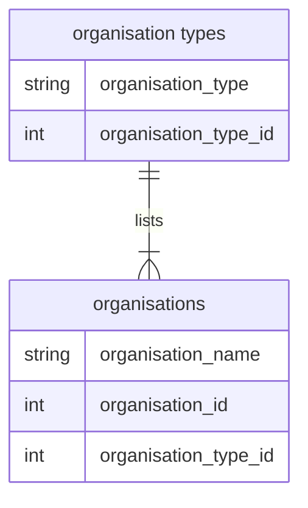

 

### Notes

 

Public Health Scotland's climate & sustainability analysis focuses on 22 health organisations.  Each organisation falls under one of [three organisation types](https://www.scot.nhs.uk/organisations/):

* 14 Regional
* 7 Special
* 1 Public Health

Each organisation has submitted one or more annual climate measures reports to [Sustainable Network Scotland](https://sustainablescotlandnetwork.org/reports).  Each of these reports has a distinct document code, hence the reports can be retrived systematically.  Altogether, a plausible relationship map thus far is

